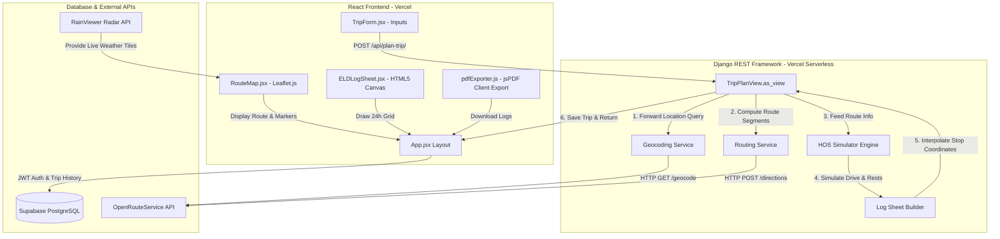

# SpotterAI — Advanced ELD Trip Planner & Log Generator

[](https://spotter-a.vercel.app/)
[](https://www.djangoproject.com/)
[](https://react.dev/)
[](https://supabase.com/)
[](https://www.fmcsa.dot.gov/regulations/hours-service)

SpotterAI is a production-ready, full-stack enterprise platform built for commercial heavy-duty truck drivers and logistics dispatchers. It automates compliance with **FMCSA 49 CFR Part 395 Hours of Service (HOS)** rules by generating optimal driving schedules, stops, and visual Electronic Logging Device (ELD) log sheets.

**Live Platform URL:** [https://spotter-a.vercel.app/](https://spotter-a.vercel.app/)

---

## 📖 Table of Contents
1. [Core Features](#-core-features)
2. [Architectural Design](#-architectural-design)
3. [FMCSA HOS Simulation Engine](#%EF%B8%8F-fmcsa-hos-simulation-engine)
4. [Tech Stack & Design Decisions](#-tech-stack--design-decisions)
5. [Database Schema](#%EF%B8%8F-database-schema)
6. [API Endpoints Reference](#-api-endpoints-reference)
7. [Local Installation & Setup](#%EF%B8%8F-local-installation--setup)
8. [Vercel Serverless Deployment Guide](#-vercel-serverless-deployment-guide)

---

## 🌟 Core Features

- **HOS Compliance Auto-Planner**: Computes heavy-vehicle trip routing and injects compliant stops, rests, and inspections according to FMCSA regulations.
- **Dynamic Weather Overlay**: Interactive Leaflet maps integrated with OpenStreetMap and a live RainViewer Weather Radar Tile Layer to alert drivers of adverse conditions.
- **Dynamic HTML5 Canvas ELD Grid**: Draws standard 24-hour daily grids dynamically in the browser using custom canvas logic. Supports high-DPI scaling and automatically inherits active CSS dark/light theme variables.
- **Audit-Ready PDF Export**: Utilizes `jsPDF` to compile canvas grid data, total driving stats, and remarks tables into downloadable PDFs.
- **Driver Portals & Safe JWT Authentication**: Supports secure driver account registration, JWT session persistence, and full trip history tracking with soft deletion.
- **Modern Premium Glassmorphism Design**: Sleek UI designed with harmonious dark and light themes, smooth CSS transitions, and SVG icons.

---

## 🏗️ Architectural Design

The platform uses a decoupled, serverless-ready microservices model:



### Request-Response Data Flow
1. The **React Frontend** collects user inputs (Current Location, Pickup, Dropoff, and Cycle Hours Used).
2. The **Django Backend** receives the request at `/api/plan-trip/`.
3. The **Geocoding Service** resolves geographic names to `(lat, lng)` tuples via OpenRouteService.
4. The **Routing Service** fetches precise Heavy Goods Vehicle (HGV) routes, returning cumulative distance, durations, and high-fidelity polylines.
5. The **HOS Simulator Engine** executes a stateful clock simulation to inject necessary HOS remarks and logs (such as pre-trips, breaks, fueling, sleeper rests, and post-trips).
6. The **Log Sheet Builder** interpolates the geographic coordinates of dynamically generated stops along the route polyline.
7. The database stores the formatted data block, and the API returns it to the client.
8. The frontend renders the Leaflet map and uses the native Canvas API to draw compliance log sheet grids.

---

## ⏱️ FMCSA HOS Simulation Engine

The core scheduling algorithm is written in pure Python inside [hos_calculator.py](file:///d:/Projects/Spotter/backend/trip_planner/services/hos_calculator.py). It operates as a stateful simulator, incrementing time step-by-step and evaluating multiple safety limits concurrently.

### Configured Constants

| Regulation Variable | Value | FMCSA Rule Context |
| :--- | :--- | :--- |
| `MAX_DRIVING_HOURS` | 11.0 hours | Maximum driving allowed within a single shift. |
| `MAX_WINDOW_HOURS` | 14.0 hours | Maximum duty window size from the start of the shift. |
| `MIN_REST_HOURS` | 10.0 hours | Minimum rest duration (off-duty/sleeper) needed to reset clocks. |
| `BREAK_AFTER_HOURS` | 8.0 hours | Driving time limit before a mandatory 30-minute break is required. |
| `MAX_CYCLE_HOURS` | 70.0 hours | Rolling cycle duty limit (reset via 34-hour restart). |
| `FUEL_INTERVAL_MILES`| 1000 miles | Fueling interval; requires a 30-minute On Duty ND stop. |
| `PRE_TRIP_DURATION`  | 1.0 hour | Pre-trip inspections; counted as On Duty ND at start of shift. |
| `PICKUP_DURATION`    | 1.0 hour | On duty time at pickup stops. |
| `DROPOFF_DURATION`   | 1.0 hour | On duty time at dropoff locations. |

### Mathematical Clock Resets
* **10-Hour sleeper Berth / Off Duty Reset**: Triggers when the driver stops for 10.0+ consecutive hours. Resets both the 11-hour driving clock and the 14-hour duty window.
* **30-Minute Break**: Triggers when driving time approaches 8.0 hours. Re-enables driving functionality.
* **Rolling Cycle Hours**: Tracks total working hours (driving + on-duty-not-driving) to prevent exceeding the 70-hour rolling rule.

---

## 🛠️ Tech Stack & Design Decisions

### Backend Engineering
* **Framework**: Django REST Framework (DRF)
  * Chosen to meet assessment criteria while providing object-relational mapping (ORM) and robust JWT serializers.
* **Database Access**: PostgreSQL (Supabase)
  * Configured via `dj_database_url` with auto-fallback to local SQLite files during development environments.
* **JWT Authentication**: `djangorestframework-simplejwt`
  * Fully stateless server authorization with secure cookie token rotation.
* **Static Assets**: WhiteNoise handles asset compilation and compression, reducing loading times.

### Frontend Engineering
* **Build Stack**: React 19 (Create React App structure)
* **Canvas API Integration**: Custom 2D context drawing engine that parses block timelines and renders proportional grids in a single canvas frame. Uses `devicePixelRatio` to prevent blurriness on Retina displays.
* **Maps Layering**: `react-leaflet` + `leaflet` configured with CartoDB Voyager tiles (adapted dynamically to dark/light templates) and RainViewer tile mappings.
* **State & Network**: Stateful context engines (`AuthContext`) manage user JWT sessions and cache auth states within LocalStorage.

---

## 🗄️ Database Schema

The platform stores planned trips under a unified schema to support driver history tracking:

```python
class TripPlan(models.Model):
    id = models.UUIDField(primary_key=True, default=uuid.uuid4, editable=False)
    driver = models.ForeignKey(User, on_delete=models.CASCADE, related_name='trips')
    created_at = models.DateTimeField(auto_now_add=True)
    origin_name = models.CharField(max_length=255)
    pickup_name = models.CharField(max_length=255)
    dropoff_name = models.CharField(max_length=255)
    total_miles = models.FloatField()
    data = models.JSONField()  # Stores complete coordinates, day timelines, and summary
```

---

## 🔌 API Endpoints Reference

| Endpoint | Method | Authentication | Payload | Description |
| :--- | :--- | :--- | :--- | :--- |
| `/api/health/` | `GET` | None | None | Service status check. |
| `/api/auth/register/` | `POST` | None | `{username, email, password}` | Registers a new driver and returns JWT tokens. |
| `/api/auth/login/` | `POST` | None | `{username, password}` | Standard login; returns JWT tokens and profile data. |
| `/api/auth/token/refresh/` | `POST` | None | `{refresh}` | Refreshes and returns a new access JWT. |
| `/api/plan-trip/` | `POST` | **Bearer JWT Required** | `{current_location, pickup_location, dropoff_location, cycle_hours_used, stops: []}` | Performs geocoding, HOS calculations, and database logging. |
| `/api/trips/` | `GET` | **Bearer JWT Required** | None | Retrieves a list of saved trips for the authenticated driver. |
| `/api/trips/<uuid:id>/` | `DELETE` | **Bearer JWT Required** | None | Removes a saved trip from the database. |

---

## ⚙️ Local Installation & Setup

### Prerequisites
* Python 3.11+
* Node.js 18+
* An OpenRouteService API Key (Get a free one [here](https://openrouteservice.org/))

### 1. Backend Setup
Clone the repository and enter the backend folder:
```bash
cd backend
```

Create and activate a virtual environment:
```bash
# Windows
python -m venv venv
venv\Scripts\activate

# macOS/Linux
python3 -m venv venv
source venv/bin/activate
```

Install the dependencies:
```bash
pip install -r requirements.txt
```

Create a `.env` file from the example:
```bash
copy .env.example .env
```

Open `.env` and fill in your variables:
```ini
SECRET_KEY=your-django-secret-key
DEBUG=True
ALLOWED_HOSTS=localhost,127.0.0.1
DATABASE_URL=sqlite:///db.sqlite3  # Use local SQLite or Supabase Postgres URI
CORS_ALLOWED_ORIGINS=http://localhost:3000
ORS_API_KEY=your-openrouteservice-api-key-here
```

Apply database migrations:
```bash
python manage.py migrate
```

Start the Django development server:
```bash
python manage.py runserver
```
The API will be live at `http://127.0.0.1:8000/api/`.

### 2. Frontend Setup
Navigate to the frontend folder:
```bash
cd ../frontend
```

Install Node modules:
```bash
npm install
```

Configure your environment variables:
Create a `.env` file in the `frontend` root:
```ini
REACT_APP_API_URL=http://localhost:8000/api/
```

Start the frontend development server:
```bash
npm start
```
The client app will launch at `http://localhost:3000/`.

---

## 🚀 Vercel Serverless Deployment Guide

This project is configured to run fully on Vercel using serverless functions for the backend and a standard web build for the frontend.

### Deploying the Backend
Vercel executes the Django backend using `@vercel/python` and routes requests through `wsgi.py`.

1. Go to the Vercel Dashboard, select **Add New Project**, and link your GitHub repository.
2. Set the **Root Directory** to `backend`.
3. Add the following **Environment Variables** in the Vercel console:
   - `SECRET_KEY` (secure token key)
   - `DATABASE_URL` (Supabase Postgres URI)
   - `ORS_API_KEY` (OpenRouteService key)
   - `CORS_ALLOWED_ORIGINS` (Your Vercel frontend URL, e.g., `https://spotter-a.vercel.app`)
   - `ALLOWED_HOSTS` (Set to `your-backend.vercel.app`)
4. Vercel will build and deploy the backend automatically using the configuration in `vercel.json`.

### Deploying the Frontend
1. Select **Add New Project** on Vercel and link the same repository.
2. Set the **Root Directory** to `frontend`.
3. Configure the **Build Settings**:
   - Build Command: `npm run build`
   - Output Directory: `build`
4. Add the following **Environment Variables**:
   - `REACT_APP_API_URL` (Set to your deployed Vercel backend API endpoint, e.g., `https://your-backend.vercel.app/api/`)
5. Click **Deploy**.

---

### 📂 Directory Architecture

```
Spotter/
├── backend/
│   ├── core/                  # Django configuration (settings, URLs, WSGI)
│   ├── trip_planner/          # Main application module
│   │   ├── services/
│   │   │   ├── geocoding.py   # Address geocoder
│   │   │   ├── routing.py     # HGV multi-leg router
│   │   │   ├── hos_calculator.py  # HOS simulator engine
│   │   │   └── log_builder.py # Log response compiler
│   │   ├── models.py          # PostgreSQL models
│   │   ├── serializers.py     # JWT & trip data serializers
│   │   └── views.py           # REST views (plan-trip, trips, auth)
│   ├── vercel.json            # Vercel deployment configurations
│   ├── build_files.sh         # Vercel serverless builder
│   └── requirements.txt
├── frontend/
│   ├── public/
│   └── src/
│       ├── api/
│       │   └── tripApi.js     # Axios API layer
│       ├── components/        # Frontend components
│       │   ├── Auth/          # Login & Signup modals
│       │   ├── RouteMap/      # Leaflet router component
│       │   ├── ELDLogSheet/   # Canvas ELD grid layout
│       │   ├── StopTimeline/  # Dynamic step tracker
│       │   └── SavedTrips/    # Saved trip records
│       ├── contexts/
│       │   └── AuthContext.js # Session controller
│       ├── utils/
│       │   ├── canvas/        # Canvas grid & block utilities
│       │   └── pdfExporter.js # PDF log compilation engine
│       └── App.jsx            # Main coordinator
└── README.md
```
